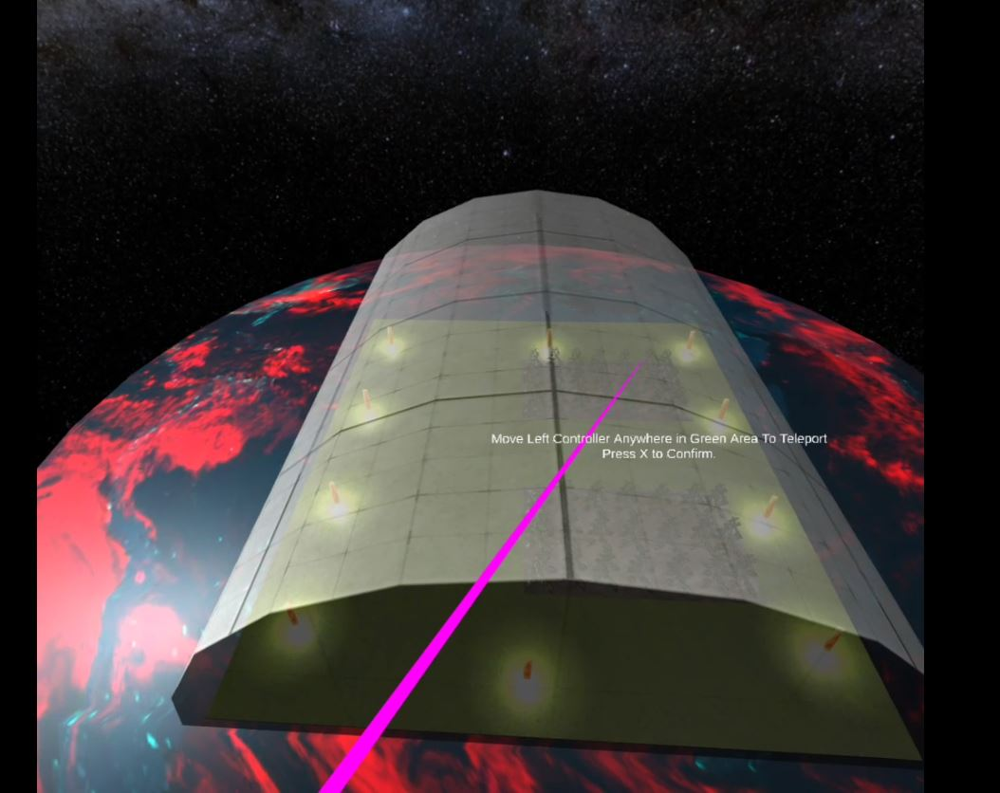

# Interactive Space Exploration Video Game in Virtual Reality using Unity Tool

- Designed Virtual Scene of Solar System consisting of Sun, Moon, Stars, cargo-ship, spaceship, etc. (Modelled using Blender 2.8)
- Implemented features like gravity, switching cameras of game, revolving and rotational motion of planets, driving spaceship. 
- Spaceship is equipped with the state-of-the-art selection ray which can pick-up and move objects using VR controllers. Used these rays to retrieve the cargo boxes released into space by the cargo-ship
- Designed a greenhouse on a Planet where I made the player do some random tasks like aligning cargo boxes, etc.
- Designed teleportation tube to teleport into the greenhouse.

 Screenshot- 
 
   

## Tools and Hardware Used:
- ***Language Used: C# (Microsoft Visual Studio, Unity, Blender)***
- Unity Version: 2018.4.16f1 Personal
- Laptop Configurations: Inspiron 5580, Memory: 8 GB
- Processor: Intel(R) Core(TM) i7-8565U CPU @ 1.80GHz[Cores 4] [Logical/Core 2] Operating System: Microsoft Windows 10 Home Single Language
- Graphic Card Configurations: NVIDIA GeForce MX150, Shared Memory - 3999MB
- Oculus Quest Device (HMD): 64GB

## Flying the spaceship
- Designed a cockpit for the spaceship. The cockpit has a large window that looks outside into the space, a yoke (and aircraft’s steering), and a teleportation tube.
- Used Oculus Quest controllers to implement the steering of the spaceship. When the user walks towards the cockpit, they are prompted for an option to control the flight.

Screenshot- 
 
   

## Minimap
- Implemented a miniature map of the world of the game. Such a minimap is an example of a World in Miniature (WIM) metaphor. The representation of the spaceship, cargo-ship, and custom Planet are highlighted (this is usually done by making the objects in different colors and blinking).

Screenshot- 
 
   

## The Teleportation Tube
- Teleportation is a type of locomotion that allows the player to move around a VR environment. 
- I have designed a ‘tube’ (a human-sized 3D cylindrical object) inside the spaceship that when walked into, will teleport the user to different locations within your VR world.
- Once the user walks into the teleportation tube, it provides an aerial view of the greenhouse to the user. User selects a 3D location in the greenhouse using a ray from one of the controllers intersecting with the greenhouse ‘floor.’ Using a button, the user confirms the teleportation location and the tube teleports the user to the specified location.

Screenshot- 
 
   

Screenshot- 
 
   

## Interacting with the cargo ship
- Designed Cargo ship and cargo boxes using Blender 3.0.
- To retrieve a cargo box, I have used a ray-based interaction method (ray-casting vectorbased pointing). Using a button, each controller activates a ray.

## Planet Greenhouse
- Greenhouse consists of a large field growing on the ground. 
- I have designed two tasks:

Planet- 
 
   

Tasks- 
 
   

   - Task 1 - Game of Light
      - In this task, the user has to turn on/off the lights present all along the boundary of the greenhouse.
      - The user has to cast rays from both the controllers and when both rays intersect at certain light, then the light component of this 3D object is disabled.
   
   Screenshot- 
 
   

      
   - Task 2 - Cargo Alignment
      - In this task, the cargoes loaded in the beginning of the game, will be used to place or you can say align them onto a cart present in the greenhouse.
      - Again, I have used rays from the controllers to select a particular cargo. 
      - After the cargo is selected, then the user can easily pick them up using the left controller. The user is given the feature of moving the object along the ray of the left controller in order for it to get placed into the cart.

   Screenshot- 
 
   
